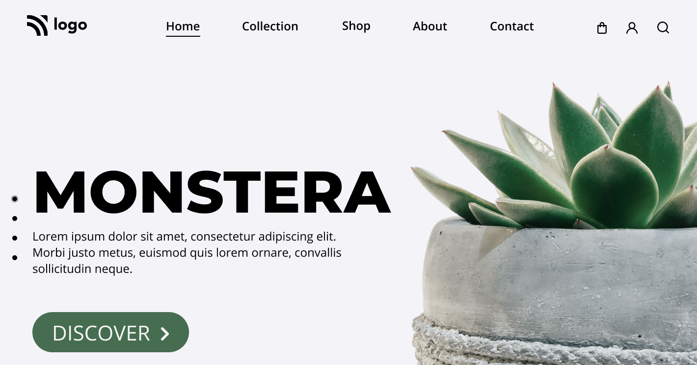

# Assignment-6

    

  

## Project 6 [Live Link](https://vinaymaurya-project-6.netlify.app/)

- Skills gained in this project 
    
    * Learned to decleare Internal stylesheets which is not a good practise.

# Time taken to finish this project

- 3 hour taken to complete it.
